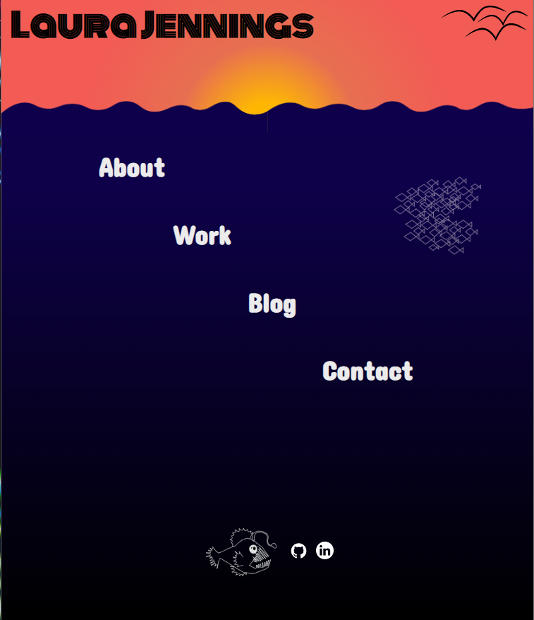
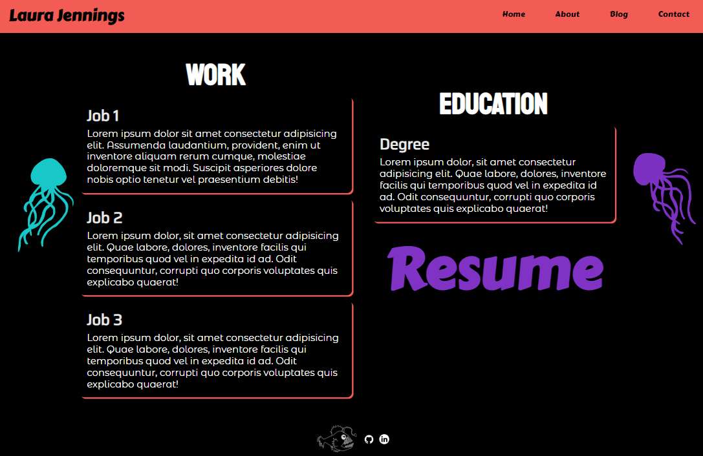
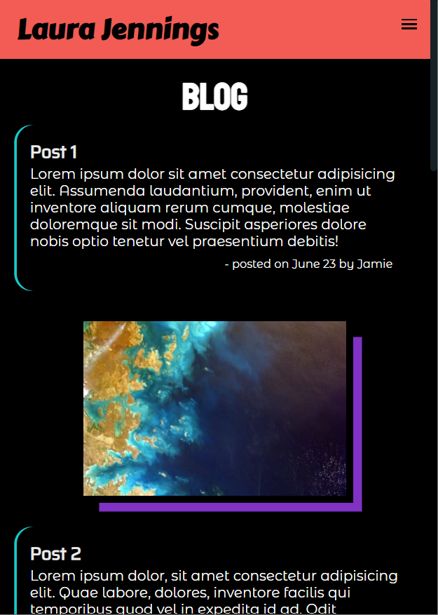

# laurajennings.github.io

[Portfolio Site](https://www.laurajenningsportfolio.com/)  
[Github Repo](https://github.com/laurajennings/laurajennings.github.io)  

# Description  
The purpose of this portfolio is to demonstrate basic html and css skills and further develop the site as more projects are completed. The target audience for this site is future employers and colleagues. The site includes a home page linking to an about, work, blog and contact page with a link to a resume on the work page.  

### Features/Functionality  
* Home page linking to a work, about, blog and contact page
* Navbar/Hamburger menu on each page
* Bright colors and styles
* Resume link on work page
* Links to github and linkedin in footer

### Sitemap  

### Screenshots  
  
  
  
  
  
  
  
### Tech Stack  
  
* HTML  
* CSS  
* SASS  
Deployment - Netlify  
Version Control - Git

