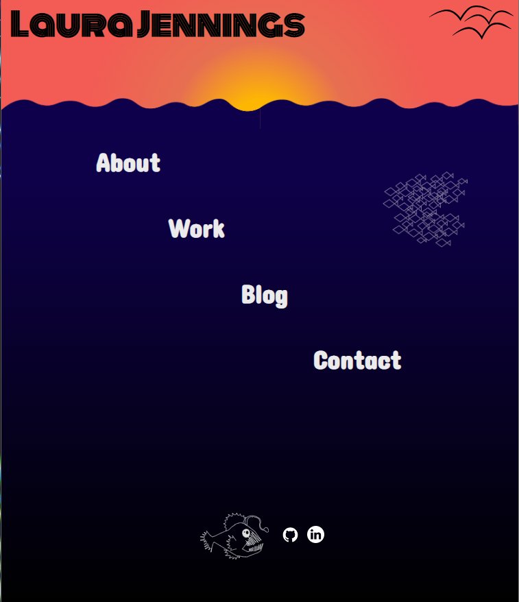
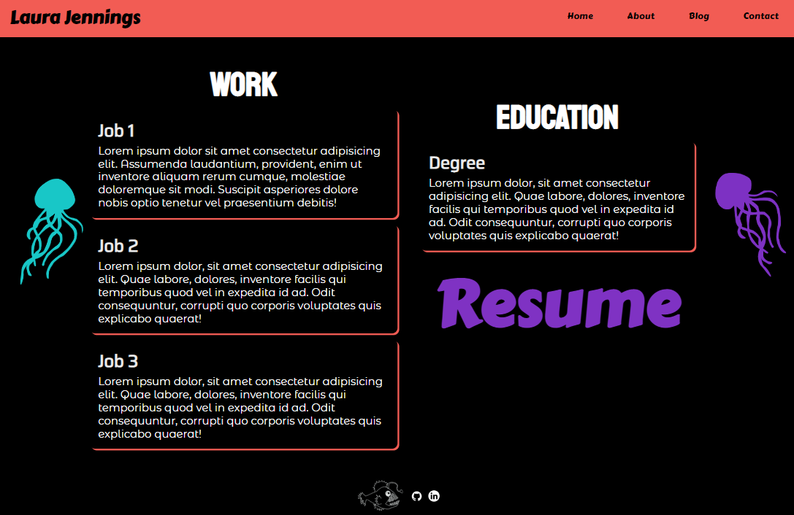
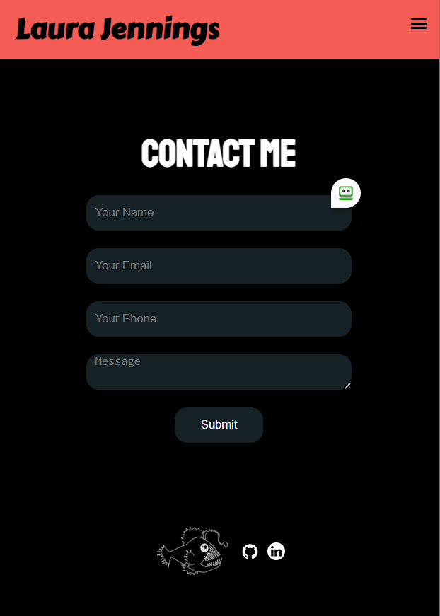

# laurajennings.github.io

Break - end a line with a double-space.
New paragraph - blank line between blocks of text.
Avoid indenting
*Emphasis* or _Emphasis_
Double * or _ make text bold
Headings - # leave a space before heading text
adding more hashes indicates smaller headings
List - *, +, or - followed by a space
1. tabs work with lists
Code - surround the code in triple backticks```
some renderers will even highlight special terms from the language if you note which language you're using after the top set of backticks.
Hypertext links - [link](url) no space between
Images -  best to use relative pathing (./battle_snail.png)

[link](https://www.laurajenningsportfolio.com/)  
[link](https://github.com/laurajennings/laurajennings.github.io)  

# Description  
The purpose of this portfolio is to demonstrate basic html and css skills and further develop the site as more projects are completed. The target audience for this site is future employers and colleagues. The site includes a home page linking to an about, work, blog and contact page with a link to a resume on the work page.  

### Features/Functionality  
* Home page linking to a work, about, blog and contact page
* Navbar/Hamburger menu on each page
* Bright colors and styles
* Resume link on work page
* Links to github and linkedin in footer

### Sitemap  


### Screenshots  
  
  
  
  
  
  
  
### Tech Stack  
  
* HTML  
* CSS  
* SASS  
Deployment - Netlify  
Version Control - Git


